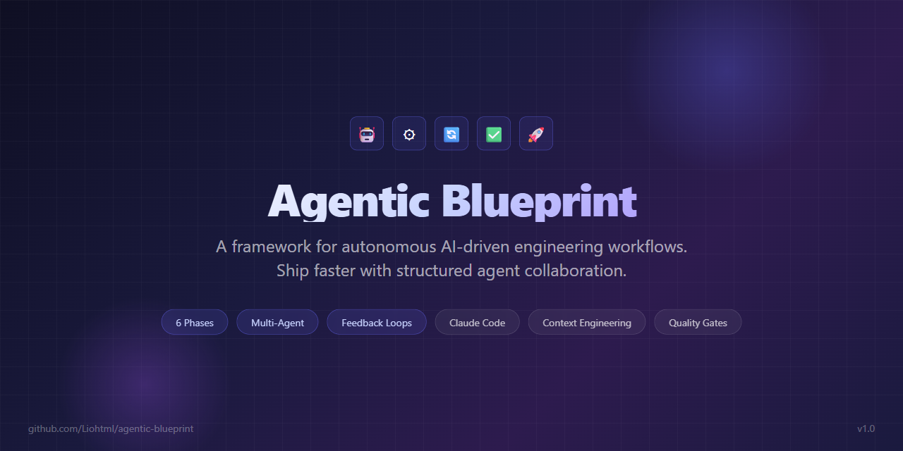

<p align="center">
  
</p>

<!-- HERO DEMO GIF — replaces the banner above once recorded (maintainer task).
     Spec: 10-15s, <2MB, terminal session: paste the one-line prompt below →
     agent fetches the blueprint and starts the interview → a phase gate fires.
     Record with e.g. asciinema + agg, or a screen recorder + gifski. -->

<h3 align="center">Autonomous agents. Human gates. Nothing merges without your Go.</h3>

<p align="center">
  Turn <a href="https://claude.com/claude-code">Claude Code</a> into a disciplined engineering system that plans, builds,
  reviews itself adversarially, ships — and improves your project in a loop that survives any crash.<br>
  It's all plain markdown. <b>You don't install it. Your agent does.</b>
</p>

<p align="center">
  <a href="#start-in-60-seconds">Start in 60 Seconds</a> &bull;
  <a href="#level-2--the-improvement-loop">The Loop</a> &bull;
  <a href="#how-it-works">How It Works</a> &bull;
  <a href="docs/GETTING-STARTED.md">Getting Started</a> &bull;
  <a href="#level-3--agent-teams-live-dashboard-sandbox">Agent Teams</a> &bull;
  <a href="CONTRIBUTING.md">Contributing</a>
</p>

<p align="center">
  
  
  <a href="https://github.com/Liohtml/agentic-blueprint/stargazers"></a>
</p>

---

## Start in 60 Seconds

Open [Claude Code](https://claude.com/claude-code) in any folder — an existing project or a brand-new empty one — and paste this **one sentence**:

```text
Read https://github.com/Liohtml/agentic-blueprint/blob/master/blueprint/templates/setup-wizard-prompt.md
and follow it as my setup wizard. I may not be technical — one question at a time, plain language.
```

That's it. Your agent fetches the blueprint, interviews you (every question comes with a suggested default — if unsure, take it), and sets everything up. **You should see at the end:** a plain-language summary plus a ready-to-copy prompt for your first feature.

> **Works with an empty folder. Never overwrites your files without asking. A human approves every merge.**

No terminal? The same workflow runs in a plain [claude.ai](https://claude.ai) chat, and the full wizard prompt is available inline — see [Other ways to start](#other-ways-to-start) below.

---

## What you just installed

Agentic Blueprint is a structured playbook for building software with AI agents: **6 phases, binary quality gates, feedback loops with hard iteration limits, and multi-agent coordination rules — all as plain markdown files** your agent reads and follows. Built for [Claude Code](https://claude.com/claude-code); the principles transfer to other agents.

We call the approach **gated autonomy**: agents work autonomously *inside* each phase, and every phase ends at a gate where a human decides. That's the whole trick — and post-2026, it's the difference between an agent system you can trust and one you have to babysit.

| | Vibe coding | With the Blueprint |
|---|---|---|
| **Planning** | "Build me X" and hope | Scoped chunks with binary done-criteria you approve first |
| **While it works** | Watch every keystroke, or look away and pray | Autonomous inside the phase; hard-capped feedback loops (5/3/7 iterations) |
| **Review** | You read 2,000 lines of diff | A second agent reviews adversarially — an agent never reviews itself |
| **When it goes wrong** | Endless "try again" spiral | Loop hits its cap, stops, escalates to you with a report |
| **Merging** | Autopilot YOLO | Nothing merges without your explicit Go |
| **Over time** | Same mistakes every session | An [Improvement Loop](blueprint/loops/improvement-loop.md) that ships fixes to its own process |

---

## Level 2 — The Improvement Loop

The part that makes this more than a prompt collection: a **system-level loop** in which agents improve your project continuously — research → adversarial devil's-advocate review → implement → test → ship → repeat. Its entire state lives in one backlog file, so it **resumes after any crash, session limit, or dead process**. Start it (or schedule it via cron/GitHub Actions) with one paste:

```text
Read https://github.com/Liohtml/agentic-blueprint/blob/master/blueprint/prompts/improvement-orchestrator.md
and follow it. Backlog: docs/BACKLOG.md. Test gate: <your test command>.
```

Autonomous, not reckless — the loop's non-negotiables: nothing ships without a devil's-advocate review, implementation agents never touch git, strategic decisions go to you, and **you** remain the only one who merges.

**Proof it works: this repository is built by its own loop.** The Improvement Loop spec, the orchestration patterns, this README — all shipped through backlog → DA review → implementation cycles, with the verdicts on the record: [the backlog](docs/BACKLOG.md) · [the retro, including honest failures](docs/retros/2026-06-10-continuous-loop-retro.md) · [the loop spec it produced](blueprint/loops/improvement-loop.md).

Under the hood: [deterministic orchestration patterns](blueprint/agents/orchestration.md) — fan-out pipelines, adversarial verification, judge panels, structured result contracts between agents — with a 4-tier model strategy (Fable 5 → Opus → Sonnet → Haiku) to keep costs sane.

---

## How It Works

```
Phase 0        Phase 1        Phase 2        Phase 3        Phase 4        Phase 5
IDEATION  -->  PLANNING  -->  BUILDING  -->  CLEANUP   -->  REVIEW   -->  MERGE
  You +          You +         Agent(s)       Agent          Review         You
  Agent          Agent         autonomously   cleans up      Agent +        approve
  brainstorm     create plan   build chunks   duplicates     Build Agent    & merge
                                                             loop to 5/5
```

| # | Principle | What It Means |
|---|-----------|---------------|
| 1 | **Human thinks, Agent builds** | You make architecture decisions. Agents execute. |
| 2 | **Context is King, less is more** | Never load the entire codebase. Reference specific files only. |
| 3 | **Code is the best documentation** | Load dependency source code directly, not prose docs. |
| 4 | **Build small, merge often** | Max 3-5 files per chunk — or one well-specified Fable 5 mission. |
| 5 | **Structure after every feature** | Cleanup phase is never skipped. |
| 6 | **Automated feedback loops** | Agents loop with defined abort conditions. No endless spinning. |

Every loop has a defined abort condition — when it fires, the agent stops and escalates to you:

| Loop | Phase | Max Iterations | On Abort |
|------|-------|---------------|----------|
| Build-Test | Building | 5 | Report blocker |
| Cleanup-Verify | Cleanup | 3 | Rollback to original |
| Review-Fix | Review | 7 | Human takes over |
| [Improvement](blueprint/loops/improvement-loop.md) | Between features (system-level) | 1-3 backlog items per cycle\* | Maintainer stop / empty backlog |

\* A per-cycle item count, not an iteration cap — cycles end on maintainer stop or an empty backlog, and the maintainer (not iteration exhaustion) is the abort authority.

The full rulebook lives in [`AGENTIC-BLUEPRINT.md`](AGENTIC-BLUEPRINT.md) and the [`blueprint/`](blueprint/) folder — phases, loops, agent roles, templates, decision trees.

---

## What this is NOT

- **Not a library, CLI, or runtime.** Markdown files and prompts. No dependencies, nothing to keep updated.
- **Not "fire and forget" autonomy.** Agents stop at gates. A human approves every merge, every scope change, every deletion. If you want an agent with root access and no questions asked, this is the wrong repo.
- **No benchmark scores, no "100x" claims.** The honest pitch: fewer disasters, less babysitting, a process that improves itself. Judge it by the [worked example](docs/examples/worked-example.md) and this repo's own [commit history](https://github.com/Liohtml/agentic-blueprint/commits/master).

---

## Level 3 — Agent Teams, Live Dashboard, Sandbox

When one agent isn't enough (requires tmux ≥ 3.x, Node.js ≥ 20, git, Claude Code CLI):

```bash
git clone https://github.com/Liohtml/agentic-blueprint.git && cd agentic-blueprint
./scripts/start-team.sh          # env checks in plain language, tmux, agent team — one command
./scripts/start-team.sh --observer <team-name>   # + live dashboard at http://localhost:4317
```

Multiple Claude Code agents in tmux split panes with strict file ownership, a shared task graph, and the **[Agent Observer](observer/README.md)** streaming live token counts, costs, and task progress per agent. Fill in [`blueprint/templates/team-prompt.md`](blueprint/templates/team-prompt.md) and paste it. Full runbook with troubleshooting: [`blueprint/agents/agent-teams.md`](blueprint/agents/agent-teams.md).

Want agents contained? The repo ships a ready **[Docker sandbox](docs/docker-sandbox.md)** (Dev Container + plain-docker paths, with an honest list of what it does *not* protect):

```bash
docker build -t agent-sandbox sandbox/
docker run -it --rm -v "$PWD":/workspace -w /workspace agent-sandbox
```

---

## Other ways to start

<details>
<summary><b>The full wizard prompt inline</b> (if you'd rather not have the agent fetch a URL)</summary>

<!-- KEEP IN SYNC: this prompt exists in README.md and blueprint/templates/setup-wizard-prompt.md — change both -->
```text
You are my setup wizard for the Agentic Engineering Blueprint
(https://github.com/Liohtml/agentic-blueprint). Set it up in this folder.
I may not be technical: use plain language, avoid jargon, and tell me in
one sentence what you are about to do before each step.

## Safety rules (apply to every step)
- Never overwrite or delete an existing file without asking me first.
- If a CLAUDE.md or AGENTS.md already exists, propose a merge — show me
  exactly what you would add — never replace it.
- Run no git commands in this project (no commit, push, branch, init) —
  a temporary clone elsewhere for fetching files is fine.

## Step 1 — Look around
Check what is in this folder and tell me what you find.
- Existing project (e.g. package.json, pyproject.toml, go.mod, Cargo.toml,
  source folders present): infer the tech stack from those files and
  confirm it with me in one sentence.
- Empty (or nearly empty) folder: say so, and make clear you will NOT
  scaffold any project structure now. Scaffolding is offered later, after
  Phase 0 (ideation) and Phase 1 (planning) of the first feature — never
  blindly up front.

## Step 2 — Get the blueprint files
From https://github.com/Liohtml/agentic-blueprint fetch exactly two things:
- AGENTIC-BLUEPRINT.md  -> into the project root
- the complete blueprint/ folder -> into the project root
Do NOT bring in observer/, docs/, scripts/, or anything else.
Pick whatever method works here: shallow git clone into a temp folder and
copy the two items over, `npx degit`, or curl the GitHub tarball and
extract only those paths. If neither git, npx, nor curl is available:
fetch the files one by one with your web-fetch capability, or tell me
the single tool to install and the exact install command — then wait
for my go. Afterwards verify that AGENTIC-BLUEPRINT.md and
blueprint/config.md exist in this folder, and clean up any temp files.

## Step 3 — Fill out blueprint/config.md by interviewing me
Ask me ONE question at a time, in plain language. For every question,
propose a sensible default (use what you learned in Step 1) and add:
"If you're unsure, take the suggestion." Cover at least: project name,
one-sentence description, tech stack, secondary agent (default: none),
review tool (default: /code-review skill), directory assignments (keep
minimal or mark as "decided later" for an empty project), and commit
style. Write my answers into blueprint/config.md as we go.

## Step 4 — Generate CLAUDE.md and AGENTS.md
Generate a project-specific CLAUDE.md and AGENTS.md in the project root,
using blueprint/templates/CLAUDE.md.template and
blueprint/templates/AGENTS.md.template plus the filled-in config.
Remember the safety rule if either file already exists.

## Step 5 — Wrap up in plain language
Give me a short summary: which files now exist, which rules apply from
now on (work happens in phases, each phase ends at a gate I approve,
nothing merges without my explicit Go), and what to do next. End by
printing this ready-to-copy prompt for my first feature:

"Read AGENTIC-BLUEPRINT.md. I want to build [describe your idea in one
sentence]. Start with Phase 0 and act as my sparring partner. Ask me one
question at a time."
```

</details>

<details>
<summary><b>No terminal? Use claude.ai</b></summary>

1. **Get the files.** Click the green **Code** button on GitHub and choose **Download ZIP** (or use **"Use this template"** if you want your own copy on GitHub). Unzip it.
2. **Upload `AGENTIC-BLUEPRINT.md`** to a new chat at [claude.ai](https://claude.ai).
3. **Paste these prompts**, one at a time:

> **Prompt 1 — understand it:**
> "Read `AGENTIC-BLUEPRINT.md` and explain in plain language how this workflow would change the way I build things with you."

> **Prompt 2 — make it yours:**
> "Read `blueprint/config.md`. Interview me one question at a time and fill it out for my project." (Upload `blueprint/config.md` first.)

> **Prompt 3 — start your first feature:**
> "Read `AGENTIC-BLUEPRINT.md`. I want to build [describe your idea in one sentence]. Start with Phase 0 and act as my sparring partner."

> **Prompt 4 — get a reviewable plan:**
> "Phase 0 is done. Move to Phase 1 and draft a plan with small chunks I can approve one by one."

For a guided end-to-end walkthrough, continue with [Getting Started](docs/GETTING-STARTED.md).

</details>

<details>
<summary><b>Manual setup</b> (clone + copy by hand)</summary>

```bash
# Clone the blueprint
git clone https://github.com/Liohtml/agentic-blueprint.git

# Copy into your project
cp agentic-blueprint/AGENTIC-BLUEPRINT.md ./
cp -r agentic-blueprint/blueprint/ ./blueprint/
```

Then edit `blueprint/config.md` (name, tech stack, secondary agent, review tool) and tell your agent:

> "Read `blueprint/config.md` and `blueprint/templates/CLAUDE.md.template`. Generate a project-specific `CLAUDE.md` based on the configuration."

</details>

New terms (Phase, Gate, Chunk, Mission Mode, ...) are defined in the [Glossary](docs/glossary.md). Non-technical? Start with [Track A in Getting Started](docs/GETTING-STARTED.md#-track-a--im-not-technical) — a guided first win in under 15 minutes, no terminal needed.

---

## Project Structure

<details>
<summary><b>What's in the box</b> (click to expand the full tree)</summary>

```
your-project/
|
|-- AGENTIC-BLUEPRINT.md          # Root: principles, phase overview, role summary (~100 lines)
|-- CLAUDE.md                     # Generated from template + config
|-- AGENTS.md                     # Generated from template + config
|
|-- blueprint/
|   |-- config.md                 # Project-specific variables (you fill this out)
|   |
|   |-- phases/                   # Detailed docs per phase
|   |   |-- 00-ideation.md        #   Problem definition, scope, success criteria
|   |   |-- 01-planning.md        #   Chunk-based planning with templates
|   |   |-- 02-building.md        #   Autonomous implementation per chunk
|   |   |-- 03-cleanup.md         #   Service layer extraction, deduplication
|   |   |-- 04-review-loop.md     #   Automated review cycle to 5/5
|   |   |-- 05-merge.md           #   Final validation and merge
|   |
|   |-- agents/                   # Role definitions
|   |   |-- claude-code.md        #   Primary engineering agent
|   |   |-- coordination.md       #   Multi-agent protocol
|   |   |-- orchestration.md      #   Deterministic multi-agent patterns (pipelines, adversarial verify, judge panels)
|   |   |-- agent-teams.md        #   Live teammates in tmux split-panes (setup + runbook)
|   |   |-- managed-agents.md     #   Cloud execution profile (Managed Agents + Outcome rubrics)
|   |
|   |-- loops/                    # Feedback loop specs
|   |   |-- build-test-loop.md
|   |   |-- cleanup-verify-loop.md
|   |   |-- review-fix-loop.md
|   |   |-- improvement-loop.md   #   System-level loop: backlog -> research -> DA review -> ship
|   |
|   |-- templates/                # Copy-paste ready templates
|   |   |-- setup-wizard-prompt.md
|   |   |-- CLAUDE.md.template
|   |   |-- AGENTS.md.template
|   |   |-- PLAN.md.template
|   |   |-- BACKLOG.md.template
|   |   |-- PR-TEMPLATE.md
|   |
|   |-- prompts/                  # Ready-to-paste agent prompts
|   |   |-- improvement-orchestrator.md  # Start/resume the improvement loop in any project
|   |   |-- repo-guardian-agent.md       # Persistent in-repo reviewer persona
|   |   |-- repo-health-agent.md         # Scheduled multi-repo audit routine
|   |
|   |-- meta/                     # Self-improvement tools
|       |-- how-to-adapt.md       #   Bootstrapping guide for new projects
|       |-- decision-trees.md     #   When to use which agent/phase/loop
|       |-- changelog.md          #   Blueprint version history
|       |-- retro-template.md     #   Post-feature retrospective
|
|-- docs/
|   |-- GETTING-STARTED.md        # Guided first-win walkthrough (two tracks)
|   |-- docker-sandbox.md         # Run agents safely in a container (two paths)
|   |-- glossary.md               # Short definitions of all blueprint terms
|   |-- examples/                 # Worked example: full 6-phase run on one small feature
|   |-- BACKLOG.md                # Roadmap / continuous-improvement backlog
|
|-- sandbox/                      # Docker sandbox template (Dockerfile + devcontainer.json)
|
|-- scripts/
|   |-- start-team.sh             # One command: checks env, starts tmux + agent team
|   |-- observe.sh                # Launch the Agent Observer dashboard
|   |-- bootstrap.sh              # Fresh-clone setup: deps + environment check
|
|-- observer/                     # Agent Observer — live dashboard for running agent teams
    |-- DATA-NOTES.md             #   Verified real shapes of ~/.claude files (data contract)
    |-- README.md                 #   Run instructions + architecture
    |-- package.json              #   `npm run observe` (build + serve :4317), `npm run dev`
    |-- bin/observe.ts            #   CLI: observe [--team] [--port] [--no-open]
    |-- src/
    |   |-- types.ts              #   Shared TypeScript contract (frozen after scaffold)
    |   |-- server.ts             #   Node http + SSE backend (no Express)
    |   |-- collector/            #   teamParser, taskParser, inboxParser, transcriptParser,
    |                             #     pricing, metrics, aggregator, watcher
    |-- web/                      #   Vite + React + Tailwind + uPlot frontend
    |   |-- src/                  #   App, AgentGrid/AgentCard, charts (token/cost/tasks/messages)
    |-- fixtures/                 #   Anonymized test fixtures for vitest
```

</details>

## Requirements

| Path | What you need |
|------|---------------|
| **Blueprint + Improvement Loop** (phases, gates, loops, templates) | An AI coding agent — built for [Claude Code](https://claude.com/claude-code), principles transfer to others — and a git-based workflow. No dependencies, no installation, no runtime. |
| **Agent Teams + Observer** (optional, Level 3) | [tmux](https://github.com/tmux/tmux/wiki) ≥ 3.x, Node.js ≥ 20, git, Claude Code CLI, and the experimental agent-teams flag. |

## Roadmap

Planned improvements live in [docs/BACKLOG.md](docs/BACKLOG.md) — the working document of the project's own Improvement Loop.

---

## Credits & Inspiration

This framework was built on the shoulders of practitioners who are pushing agentic engineering forward:

### Direct Inspiration

- **[Mickey / pawel-cell](https://github.com/pawel-cell/micky-podcast-agentic-engineering)** — The agentic engineering workflow, skills for source code context, code structure cleanup, and the grep-loop review workflow that directly inspired this blueprint's feedback loop architecture.

- **[Michael Shimeles](https://github.com/michaelshimeles/skills)** — Skills collection that informed the modular skill-based approach to agent configuration.

- **[David Ondrej](https://www.youtube.com/@DavidOndrej)** — For hosting the podcast "Why This Dev Ships 100x Faster Than 99% of Engineers" that captured and disseminated these workflows to a broader audience.

### Conceptual Foundations

- **[Andrej Karpathy](https://x.com/karpathy)** — The auto-research loop concept referenced throughout the video, which forms the philosophical basis for automated feedback loops in this blueprint.

- **[Vercel / open-source CLI](https://github.com/nicepkg/opensource)** — The `npx open-source` approach to loading dependency source code directly into project context, replacing traditional documentation.

- **[Greptile](https://www.greptile.com/)** — The AI code review tool whose confidence scoring system (1-5) inspired the quality gate architecture in Phase 4.

### The Community

The agentic engineering community on X/Twitter, whose daily experiments, debates, and shared learnings about context engineering, model selection, and agent workflows continuously shape how we build with AI.

---

## License

[MIT](LICENSE) — use it however you want.

---

<p align="center">
  <sub>Built with structured agent collaboration — through this repo's own Improvement Loop. Agents wrote 95% of this. A human made sure it was right.</sub>
</p>
